# CBFL
## Introduction
Welcome to the project repository for the paper **Tackling Multi-Class Imbalance in Next Activity Prediction with Class-Balanced Focal Loss**.
This repository provides the implementation details and supplementary materials to support the findings presented in the paper:

To help navigate the repository, the following overview outlines the contents and links to the materials referenced in the paper.

- [Data Preprocessing and Feature Encoding](#data-preprocessing-and-feature-encoding)
  - Experimental results comparing selected encoding strategies against alternative approaches.
- [Implemented Architectures](#implemented-architectures)
- [Loss Functions, Training and Evaluation](#loss-functions-training-and-evaluation)
- [Results](#results)
  - Detailed report on overall model performance, including additional metrics such as AUC-PR, accuracy, precision, and recall.
  - Complete set of visualizations illustrating F1-score trends for majority and minority groups across varying majority/minority thresholds.
- [Python Environment Setup](#python-environment-setup)

## Data Preprocessing and Feature Encoding
 
### Comparison of encoding strategies
The table below reports F1-scores on the validation set for our selected encoding strategy (`Selected`) and a widely used alternative (`Alternative`). For XGBoost, we employ prefix-based index encoding as the selected strategy and compare it against prefix-based aggregation encoding, a common choice in prior work. For deep learning models, we use trace-based encoding as our selected strategy, with prefix-based index encoding as the alternative.

The results show that our selected strategies perform on par with or better than the alternatives, supporting our choices.

|              |**BPIC2017**    |        |**BPIC2019**|            |**BPIC2020**|            |**BAC**     |            |
|--------------|------------|------------|------------|------------|------------|------------|------------|------------|
|              | Selected   | Alternative| Selected   | Alternative| Selected   | Alternative| Selected   | Alternative|
| XGBoost      | 76.2       |72.6 (-3.6) | 42         |37.1 (-4.9) | 44.3       |44.4 (+0.1) | 42.7       |42.1 (-0.6) |
| LSTM         | 77.0       |78.0 (+1.0) | 36.1       |36.8 (+0.7) | 43.4       |43.5 (+0.1) | 40.6       |41.3 (+0.7) |
| Transformer  | 77.8       |78.2 (+0.4) | 37.2       |37.1 (-0.1) | 43.7       |44.9 (+1.2) | 41.0       |40.9 (-0.1) |
| xLSTM        | 78.2       |78.6 (+0.4) | 36.5       |35.8 (-0.7) | 44.5       |44.7 (+0.2) | 41.5       |41.8 (-0.3) |


### Scripts
**`data_processing/`** contains scripts for data preprocessing, dataset splitting, and the generation of traces, prefixes, and next activities:  
- `preprocessing.py` performs data preprocessing
- `train_test_split.py` splits the dataset into training, validation and test sets..  
- `create_trace_prefix.py`: generates traces (for trace-based encoding), as well as prefixes and next activities (for prefix-based encoding). 

## Implemented Architectures
**`models/`** contains the implementation scripts for all models used in this study:
- `create_dl_model.py` defines the deep learning architectures, including LSTM, Transformer, and xLSTM models.
- `xgboost.ipynb` implements the XGBoost model.

## Loss Functions, Training and Evaluation
**`train_evaluate/`** contains scripts that define loss functions, including Cross-Entropy Loss (CEL), Class-Balanced Loss (CBFL), and inverse frequency weighting, as well as functions for training, validation, and evaluation:
- `loss_function.py` implements the loss functions.
- `train_evaluate.py` contains functions for training, validation, and evaluation.  

## Results
### Overall performance with additional metrics
The following table includes additional metrics to assess overall predictive performance, reported as macro-averages across all classes. 
These metrics include Area Under the Precision-Recall Curve (`AUC-PR`), Accuracy (`Acc`), Precision (`Pre`), and Recall (`Rec`). 
Best results are **bold**.

|              |**BPIC2017**|         |         |           |**BPIC2019**|         |         |           |**BPIC2020**|         |         |          |**BAC**     |         |         |            |
|--------------|------------|---------|---------|-----------|------------|---------|---------|-----------|------------|---------|---------|----------|------------|---------|---------|------------|
|              |     Acc    | Pre     | Rec     | AUC-PR    | Acc        | Pre     | Rec     | AUC-PR    | Acc        | Pre     | Rec     | AUC-PR   | Acc        | Pre     | Rec     | AUC-PR     |
|**Baseline:CEL**|
| XGBoost      |88.67       |81.26    |75.65    |**69.11**  | 81.02      |35.15    |27.41    |**27.26**  | 89.97      |52.85    |51.79    |**38.46** |78.87       |59.31    |40.94    | 41.95      |
| LSTM         |88.69       |82.98    |75.63    | 65.97     | 81.51      |35.09    |28.87    | 24.74     |**90.03**   |49.87    |50.45    | 38.08    |78.51       |55.22    |39.48    | 38.98      |
| Transformer  |**88.90**   |**83.94**|75.52    | 68.60     | 81.89      |37.09    |28.79    | 26.70     | 90.00      |49.68    |50.52    | 38.21    |78.88       |57.62    |40.14    | 40.92      |
| xLSTM        |88.54       |82.03    |77.14    | 68.37     | 81.78      |**39.04**|28.84    | 22.84     | 89.88      |49.80    |50.45    | 38.03    |78.55       |57.45    |40.31    | 40.57      |
|**CBFL**|
| XGBoost      |87.97       |78.97    |79.41    | 68.60     | 80.76      |31.63    |26.49    | 25.53     |84.43       |52.97    |**57.49**| 37.85    |**78.89**   |**60.81**|42.90    | **42.27**  |
| LSTM         |88.03       |78.43    |79.93    | 60.66     | 81.65      |36.15    |**32.44**| 20.78     |83.94       |**57.11**|52.81    | 37.88    |78.62       |59.83    |42.82    | 34.04      |
| Transformer  |87.90       |79.15    |**81.28**| 67.52     |**81.91**   |37.01    |30.09    | 24.96     |83.67       |51.45    |52.54    | 37.54    |78.70       |60.24    |**44.07**| 38.08      |
| xLSTM        |88.09       |78.91    |80.10    | 65.59     | 81.47      |35.31    |31.46    | 20.71     |85.59       |53.57    |53.75    | 37.27    |78.61       |58.47    |43.21    | 38.97      |

### Visualizations with varying majority/minority thresholds
<p align="left">
  
</p>

<p align="left">
  
  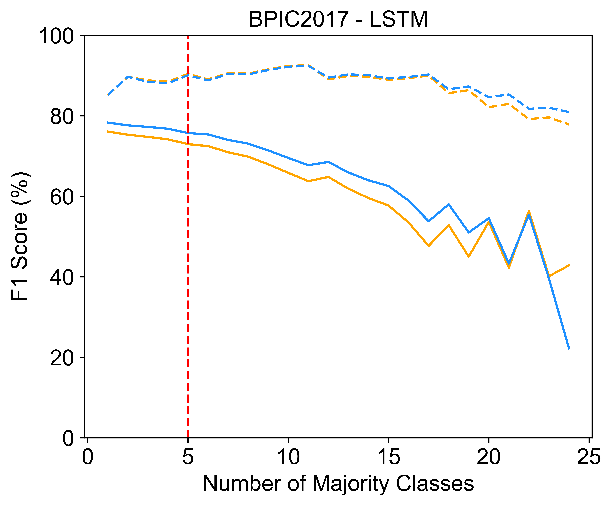
  
  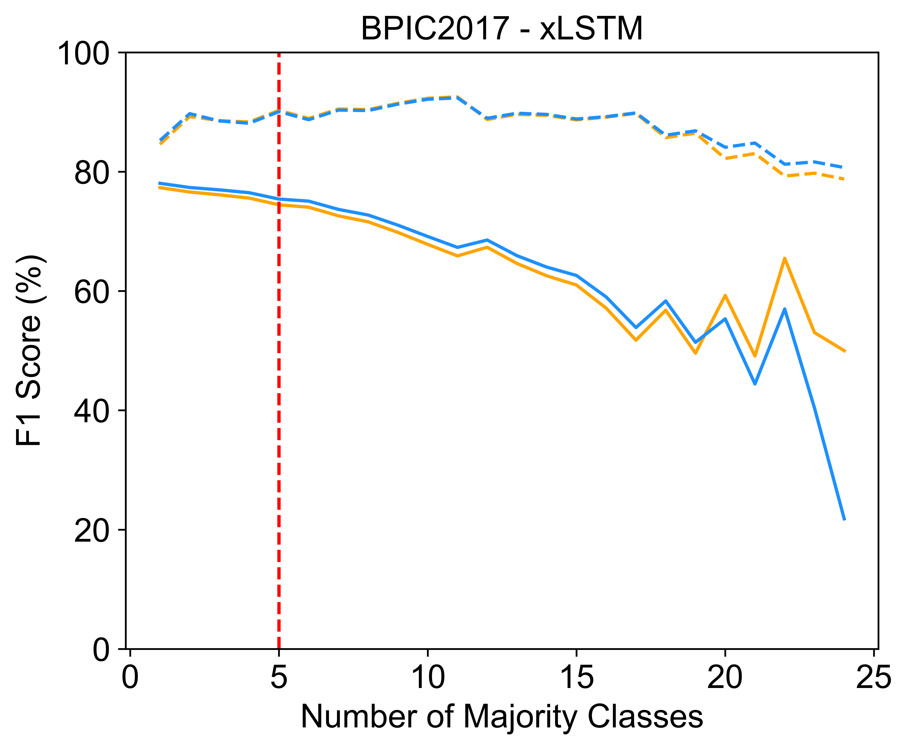
</p>

<p align="left">
  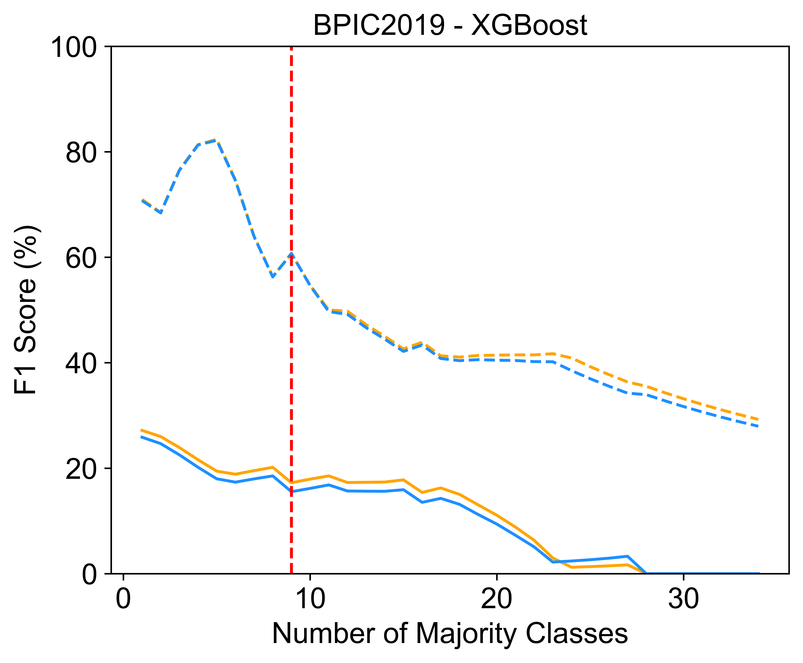
  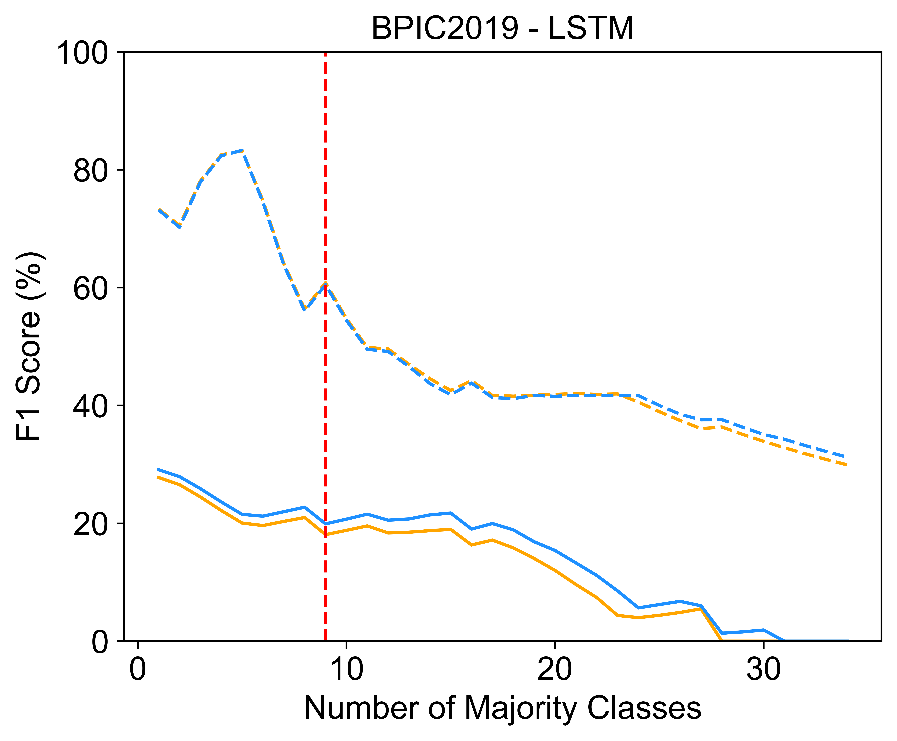
  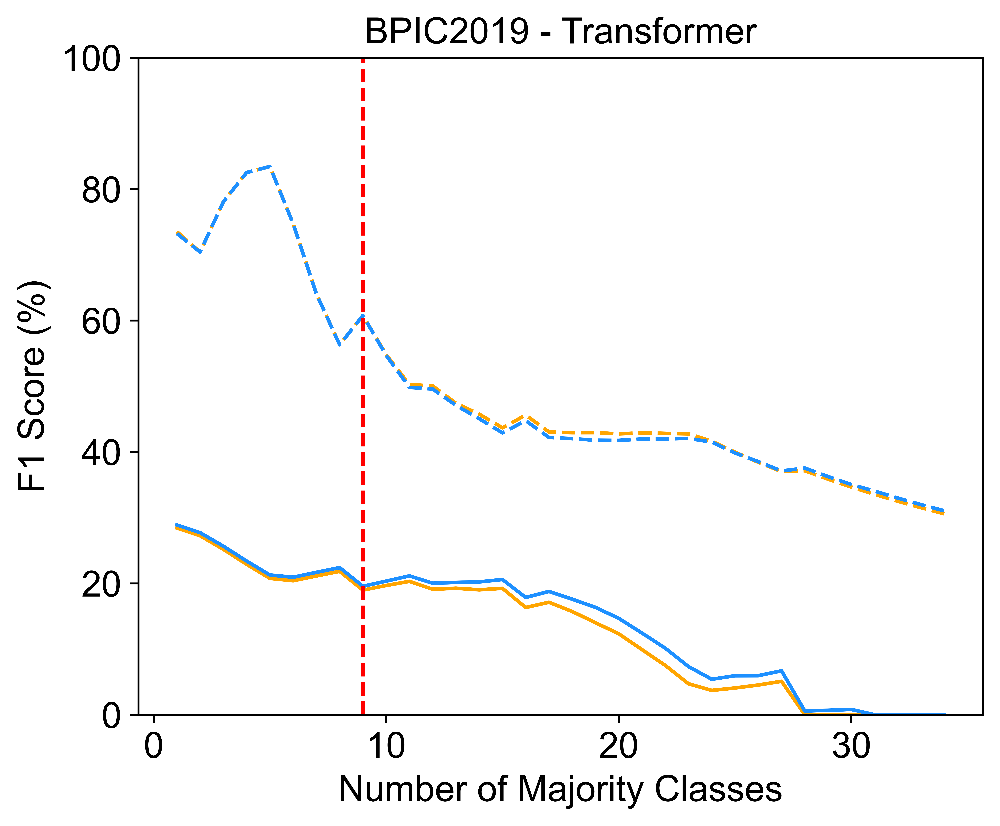
  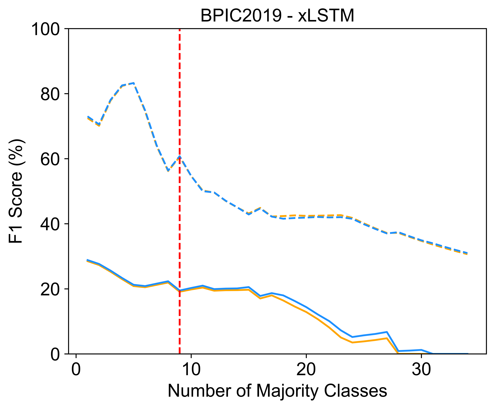
</p>

<p align="left">
  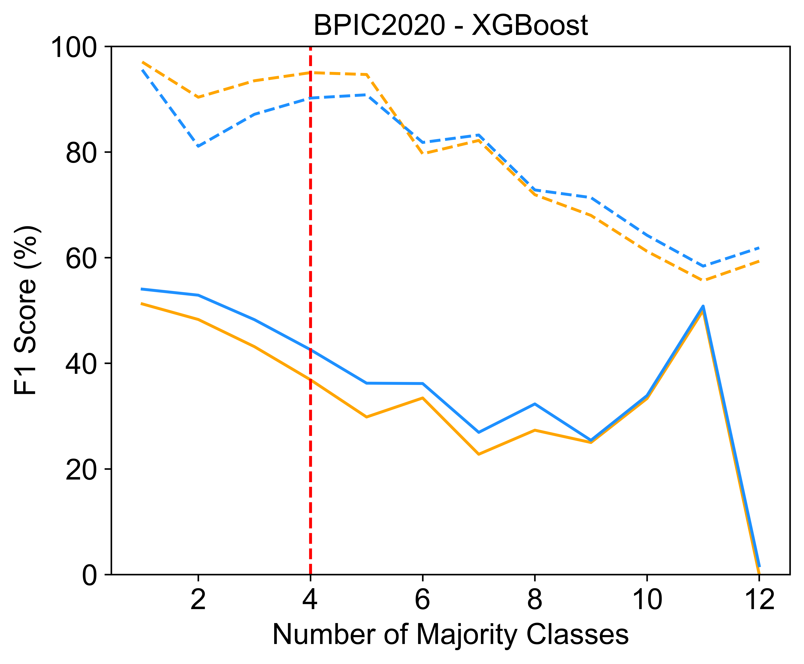
  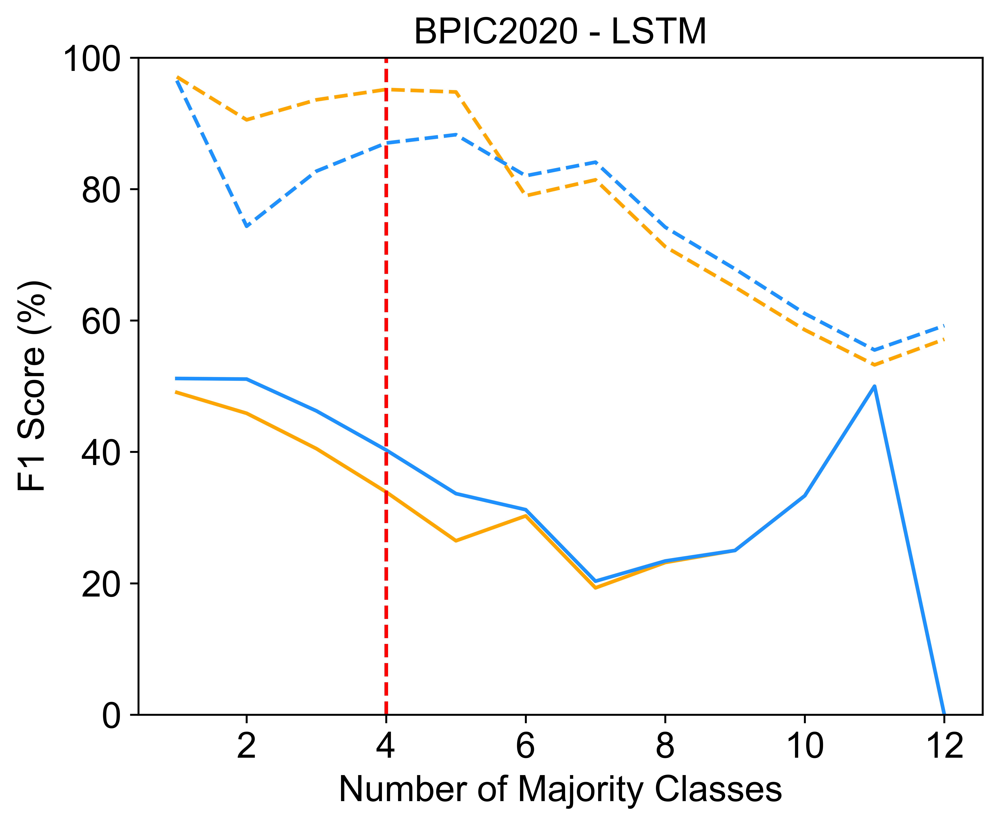
  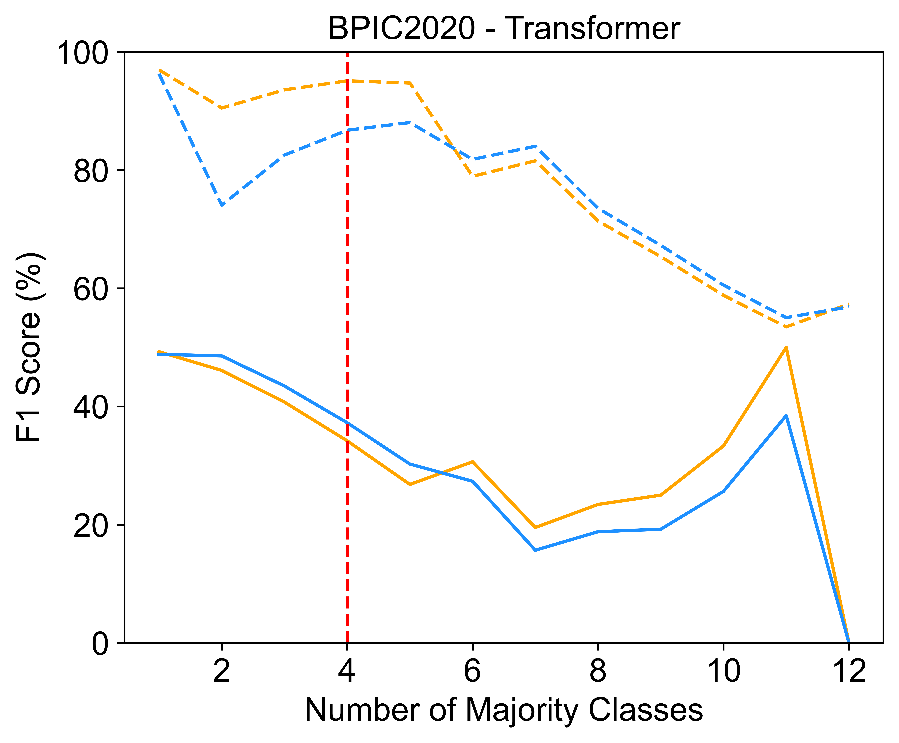
  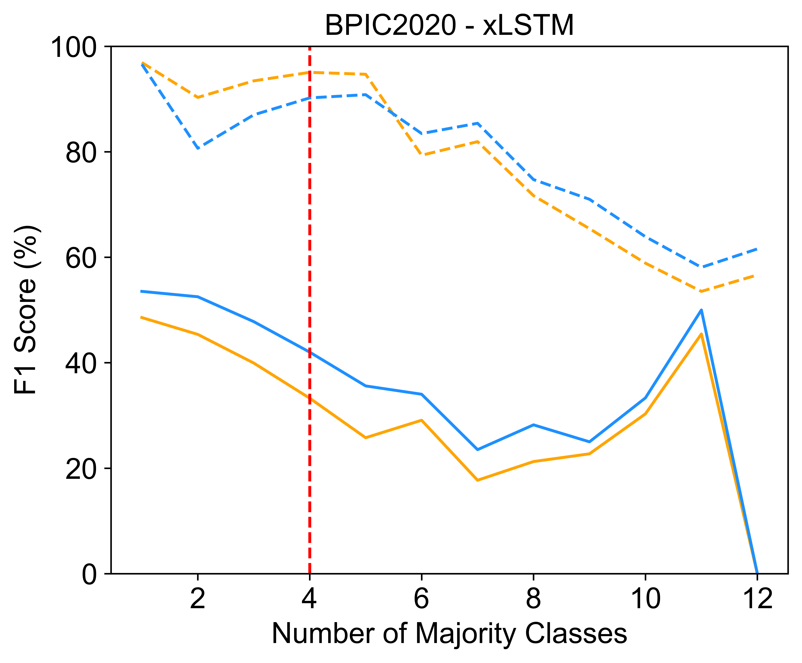
</p>

<p align="left">
  
  
  
  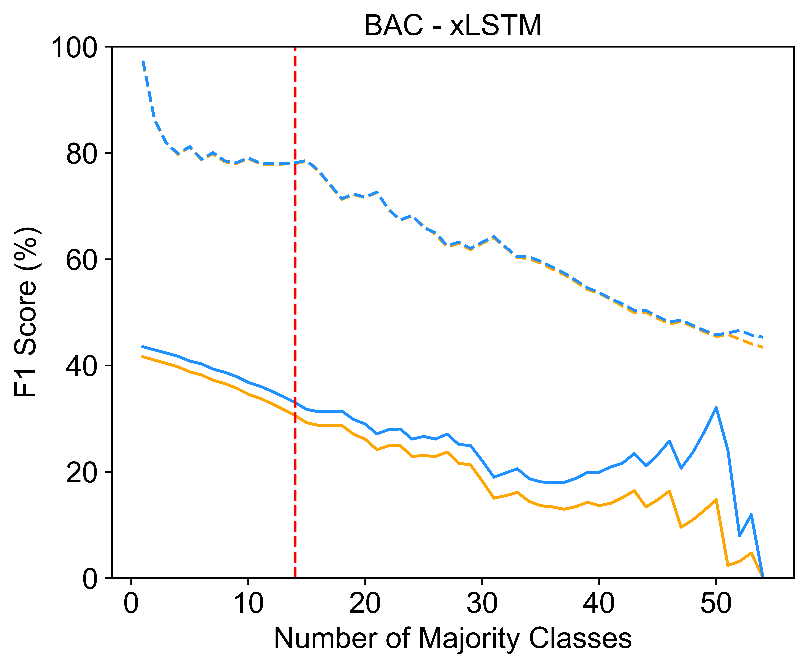
</p>

## Python Environment Setup
The implementation is based on **Python 3.12.7**. To set up the environment, download `requirements.txt` and run the following command::

```bash
pip install -r requirements.txt
